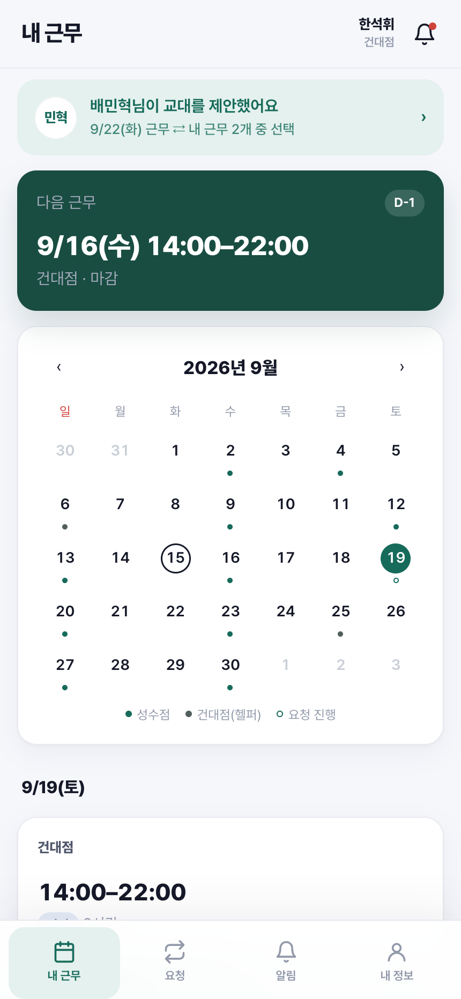
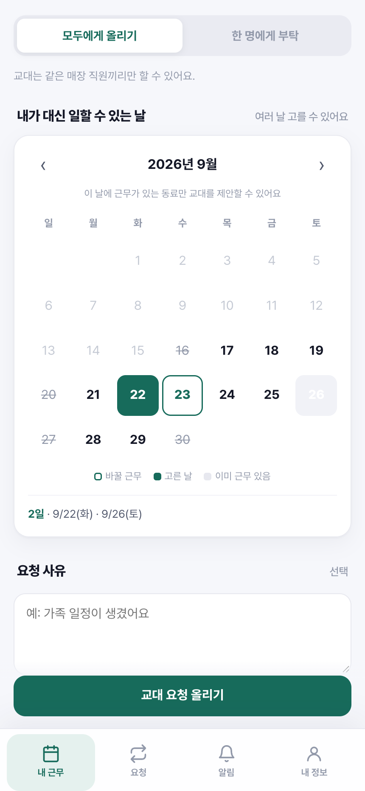
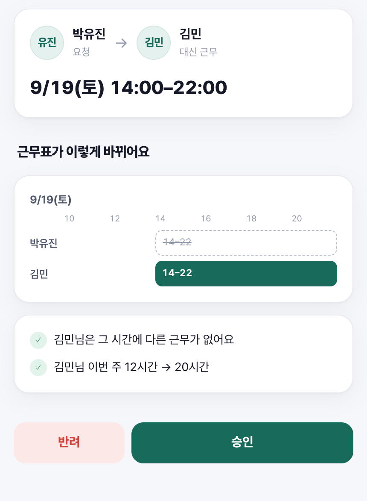
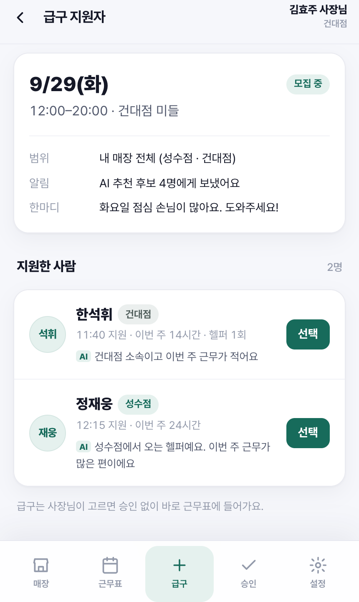

# 대타구함

> 카카오톡에 흩어진 대타 연락을 **요청 → 지원 → 승인 → 근무표 반영**까지 한 흐름으로 연결하는 교대 관리 서비스

대타구함은 알바생의 대타·교대 요청과 점장·사장의 근무표 관리를 함께 다루는 모바일 웹 서비스입니다. 단순히 사람을 구하는 데서 끝내지 않고, 변경 결과가 실제 근무표에 남도록 설계했습니다.

[라이브 데모](https://oojoyhh.github.io/daetaguham/) · [서비스 개요서](docs/overview.pdf) · [OpenAPI 명세](docs/openapi.yml) · [데이터 모델](docs/database.dbml)

> 현재 저장소에는 샘플 데이터로 동작하는 인터랙티브 HTML 프로토타입과 API·DB 설계 문서가 들어 있습니다. Spring Boot·PostgreSQL 백엔드 기반을 구축했으며, 업무 API는 순차적으로 구현 중입니다.

## 해결하려는 문제

아르바이트 현장에서는 대타 요청, 지원 의사, 승인 결과가 카카오톡 대화에 흩어집니다. 그 결과 누가 대신 일하는지 다시 확인해야 하고, 확정된 변경이 근무표에 반영되지 않는 문제가 생깁니다.

대타구함은 세 가지를 한 서비스 안에서 해결합니다.

1. 알바생은 자신의 근무에서 바로 대타 또는 교대를 요청합니다.
2. 지원자와 요청자는 가능한 날짜·근무를 비교해 상대를 정합니다.
3. 점장 또는 사장이 변경 전후를 확인하고 승인하면 근무표에 반영됩니다.

## 역할별 핵심 흐름

| 사용자 | 할 수 있는 일 | 대표 흐름 |
| --- | --- | --- |
| 알바생 | 내 근무 확인, 대타·교대 요청, 공개 요청 지원, 지정 제안 응답 | 근무 선택 → 요청 등록 → 지원자 선택 → 승인 대기 |
| 점장 | 오늘 현황 확인, 근무표 작성, 직원 관리, 변경 승인·반려 | 승인 요청 확인 → 변경 전후 비교 → 근무표 반영 |
| 사장 | 여러 매장 관리, 빈 근무 급구, 지원자 선택, 매장 설정 | 빈 근무 확인 → 급구 등록 → 후보 알림 → 배정 |

## 주요 화면

<table>
  <tr>
    <td align="center"><b>내 근무와 요청 진입</b></td>
    <td align="center"><b>교대 가능 날짜 복수 선택</b></td>
  </tr>
  <tr>
    <td></td>
    <td></td>
  </tr>
  <tr>
    <td align="center"><b>변경 전후 확인과 승인</b></td>
    <td align="center"><b>급구 지원자 비교</b></td>
  </tr>
  <tr>
    <td></td>
    <td></td>
  </tr>
</table>

## 설계 포인트

### 대타·교대·급구를 하나의 요청 모델로 관리

세 요청을 `shift_requests` 테이블에 통합하고 `type`, `mode`, `scope`로 구분했습니다. 공개 모집과 특정 동료에게 보내는 제안도 같은 확정 흐름을 사용합니다.

### 여러 날짜와 여러 교대 후보를 보존

요청자가 가능한 날짜 여러 개를 제시하고, 지원자도 바꿀 수 있는 근무 여러 개를 제안할 수 있습니다. 이를 각각 `request_available_dates`, `application_offer_shifts` 관계 테이블로 분리했습니다.

### AI는 판정 대신 설명을 담당

후보 추천은 근무 겹침, 소속, 근무 가능 시간 같은 규칙으로 먼저 걸러냅니다. 이후 근무시간과 도움 이력 등을 점수화하고, AI는 추천 이유를 한 줄로 설명하도록 설계했습니다.

### 변경 이력을 지우지 않음

승인된 변경은 담당자만 덮어쓰는 대신 요청·지원 기록과 연결해 남깁니다. 근무표에서는 변경 전후와 최종 담당자를 확인할 수 있습니다.

## 구현 범위

| 구분 | 현재 상태 |
| --- | --- |
| UI 프로토타입 | 역할별 주요 화면과 핵심 전환 구현 |
| 데모 상태 | `localStorage`로 요청·승인 결과를 다음 화면에 반영 |
| API | OpenAPI 3.0.3, 41 paths / 47 operations 설계 |
| 데이터 모델 | DBML, 12 tables / 22 foreign keys 설계 |
| 백엔드 | Spring Boot 4.1.1 기반, 헬스 체크 구현 |
| DB | PostgreSQL 17 연동, Flyway V1~V3(회원·매장·직원·시간대·근무·가능 시간) 구현 |
| 인증 API | 회원가입·로그인·JWT 인증·내 정보 조회 구현 |
| 매장·직원 API | 매장 생성·초대코드·참여 신청·직원 조회·승인·거절·점장 임명 구현 |
| 근무표 API | 시간대·근무 CRUD, 월간 일괄 저장·초기화, 직원 자격·매장 간 시간 겹침 검증 구현 |
| 개인 일정 API | 전체 매장 내 근무 캘린더, 헬퍼·진행 상태 계산, 요일별 근무 가능 시간 저장 구현 |
| AI 추천 모델 | 추천 규칙과 응답 구조만 설계, 실제 모델 미연동 |

상세 진행 상태와 남은 작업은 [백엔드 개발 체크리스트](docs/backend-checklist.md)에서 확인할 수 있습니다.

## 로컬에서 실행하기

별도 설치 없이 Python 정적 서버로 실행할 수 있습니다.

```bash
git clone https://github.com/oojoyhh/daetaguham.git
cd daetaguham
python3 -m http.server 8767 --directory web
```

브라우저에서 `http://127.0.0.1:8767`을 열고 알바생·점장·사장 중 한 역할을 선택합니다. 첫 화면의 **데모 초기화** 버튼을 누르면 저장된 샘플 상태를 처음으로 되돌릴 수 있습니다.

### 백엔드 실행

Java 21과 Docker Desktop이 필요합니다. 저장소 루트에서 PostgreSQL을 시작한 뒤 Spring Boot를 실행합니다.

```bash
docker compose up -d postgres
cd backend
./gradlew bootRun
```

- 서비스 헬스 체크: `http://localhost:8080/api/health`
- DB 연결을 포함한 앱 상태: `http://localhost:8080/api/actuator/health`
- 로컬 PostgreSQL: `localhost:15432`

환경변수를 변경해야 한다면 `.env.example`을 복사해 `.env`로 사용합니다. `.env`는 Git에 포함되지 않습니다.
배포 환경의 `JWT_SECRET`은 반드시 32byte 이상의 별도 무작위 값으로 설정해야 합니다.

## 프로젝트 구조

```text
daetaguham/
├── backend/             # Spring Boot REST API
├── compose.yml         # 로컬 PostgreSQL 개발 환경
├── web/                 # 역할별 인터랙티브 HTML 프로토타입
├── docs/
│   ├── screenshots/     # README 대표 화면
│   ├── openapi.yml      # REST API 명세
│   ├── database.dbml    # ERD 원본
│   └── overview.pdf     # 서비스 개요서
└── README.md
```

## 다음 단계

- 매장 전달사항과 오늘 현황 API 구현
- 대타·교대·급구 요청 및 승인 API 구현
- 근무 겹침·권한·승인 상태 규칙 통합 테스트
- 규칙 기반 후보 추천과 AI 설명 생성 연결
- 모바일 접근성 및 주요 사용자 흐름 테스트
