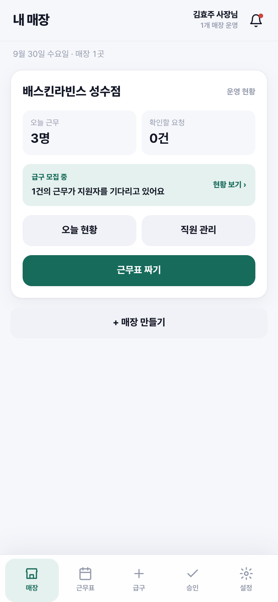
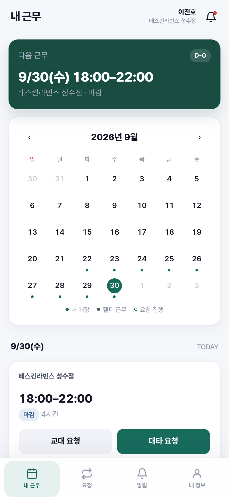
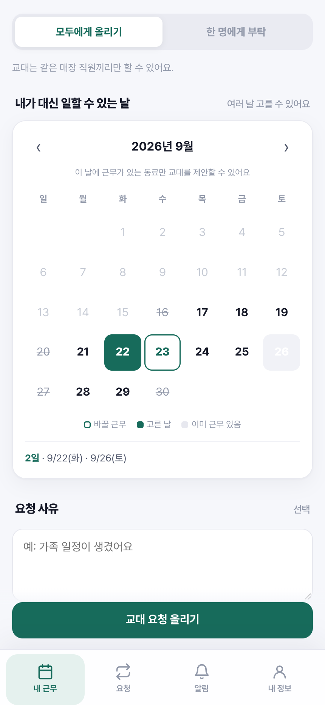
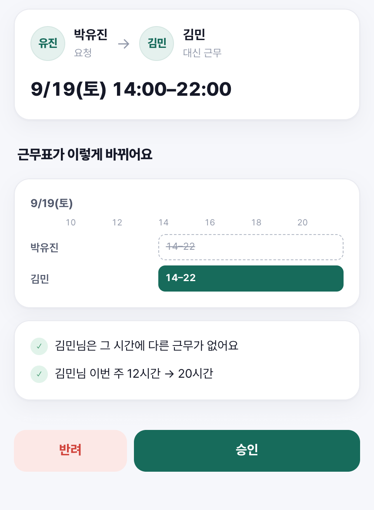
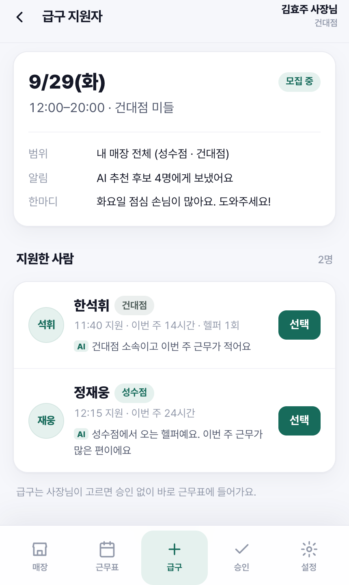

# 대타구함

> 카카오톡에 흩어진 대타 연락을 **요청 → 지원 → 승인 → 근무표 반영**까지 한 흐름으로 연결하는 교대 관리 서비스

대타구함은 알바생의 대타·교대 요청과 점장·사장의 근무표 관리를 함께 다루는 모바일 웹 서비스입니다. 단순히 사람을 구하는 데서 끝내지 않고, 변경 결과가 실제 근무표에 남도록 설계했습니다.

[라이브 데모](https://oojoyhh.github.io/daetaguham/) · [서비스 개요서](docs/overview.pdf) · [OpenAPI 명세](docs/openapi.yml) · [데이터 모델](docs/database.dbml)

> GitHub Pages 프론트엔드와 Render의 Spring Boot·PostgreSQL 백엔드를 연결해 배포했습니다. 로그인 후에는 근무·요청·승인·알림이 실제 API와 DB에 반영되며, 로그인 없이도 역할별 샘플 화면을 둘러볼 수 있습니다.

## 해결하려는 문제

아르바이트 현장에서는 대타 요청, 지원 의사, 승인 결과가 카카오톡 대화에 흩어집니다. 그 결과 누가 대신 일하는지 다시 확인해야 하고, 확정된 변경이 근무표에 반영되지 않는 문제가 생깁니다.

대타구함은 세 가지를 한 서비스 안에서 해결합니다.

1. 알바생은 자신의 근무에서 바로 대타 또는 교대를 요청합니다.
2. 지원자와 요청자는 가능한 날짜·근무를 비교해 상대를 정합니다.
3. 점장 또는 사장이 변경 전후를 확인하고 승인하면 근무표에 반영됩니다.

## 역할별 핵심 흐름

| 사용자 | 할 수 있는 일 | 대표 흐름 |
| --- | --- | --- |
| 알바생 | 내 근무 확인, 대타·교대 요청, 공개 요청 지원, 지정 제안 응답 | 근무 선택 → 요청 등록 → 지원자 선택 → 승인 대기 |
| 점장 | 오늘 현황 확인, 근무표 작성, 직원 관리, 변경 승인·반려 | 승인 요청 확인 → 변경 전후 비교 → 근무표 반영 |
| 사장 | 여러 매장 관리, 빈 근무 급구, 지원자 선택, 매장 설정 | 빈 근무 확인 → 급구 등록 → 후보 알림 → 배정 |

## 주요 화면

<p align="center">
  
</p>
<p align="center"><b>사장 매장 현황 · 실제 배포 데이터</b></p>

<table>
  <tr>
    <td align="center"><b>내 근무 · 실제 배포 데이터</b></td>
    <td align="center"><b>교대 가능 날짜 복수 선택</b></td>
  </tr>
  <tr>
    <td></td>
    <td></td>
  </tr>
  <tr>
    <td align="center"><b>변경 전후 확인과 승인</b></td>
    <td align="center"><b>급구 지원자 비교</b></td>
  </tr>
  <tr>
    <td></td>
    <td></td>
  </tr>
</table>

## 설계 포인트

### 대타·교대·급구를 하나의 요청 모델로 관리

세 요청을 `shift_requests` 테이블에 통합하고 `type`, `mode`, `scope`로 구분했습니다. 공개 모집과 특정 동료에게 보내는 제안도 같은 확정 흐름을 사용합니다.

### 여러 날짜와 여러 교대 후보를 보존

요청자가 가능한 날짜 여러 개를 제시하고, 지원자도 바꿀 수 있는 근무 여러 개를 제안할 수 있습니다. 이를 각각 `request_available_dates`, `application_offer_shifts` 관계 테이블로 분리했습니다.

### AI는 판정 대신 설명을 담당

후보 추천은 근무 겹침, 소속, 근무 가능 시간 같은 규칙으로 먼저 걸러냅니다. 이후 주간 근무시간과 도움 이력을 점수화해 순위를 정하며, 설명 생성기는 추천 결과를 바꾸지 못하도록 분리했습니다. 현재는 항상 같은 결과를 내는 규칙 기반 한 줄 설명을 사용하고, 향후 외부 AI 설명 생성기로 교체할 수 있는 구조입니다.

### 변경 이력을 지우지 않음

승인된 변경은 담당자만 덮어쓰는 대신 요청·지원 기록과 연결해 남깁니다. 근무표에서는 변경 전후와 최종 담당자를 확인할 수 있습니다.

## 구현 범위

| 구분 | 현재 상태 |
| --- | --- |
| UI | 로그인 없이 보는 역할별 샘플과, 실제 API 데이터로 동작하는 로그인 흐름 구현 |
| 데모 데이터 | 배포 DB에 성수점 근무표·전달사항·대타·교대·급구 요청을 멱등적으로 생성 |
| API | OpenAPI 3.0.3, 41 paths / 47 operations 명세와 핵심 사용자 흐름 구현 |
| 데이터 모델 | DBML, 12 tables / 22 foreign keys 설계 |
| 백엔드 | Spring Boot 4.1.1 기반, 인증·매장·근무·요청·알림 핵심 API 구현 |
| DB | PostgreSQL 17 연동, Flyway V1~V7(설계된 12개 테이블 전체) 구현 |
| 인증 API | 회원가입·로그인·JWT 인증·내 정보 조회 구현 |
| 매장·직원 API | 매장 생성·조회·설정·초대코드 재발급, 참여 신청·직원 조회·승인·거절·점장 임명 구현 |
| 근무표 API | 시간대·근무 CRUD, 월간 일괄 저장·초기화, 직원 자격·매장 간 시간 겹침 검증 구현 |
| 개인 일정 API | 전체 매장 내 근무 캘린더, 헬퍼·진행 상태 계산, 요일별 근무 가능 시간 저장 구현 |
| 매장 현황 API | 전달사항 작성·조회·삭제, 오늘 근무자·참여 대기·주간 빈 근무 집계 구현 |
| 요청 API | 공개 게시판·내 활동 조회, 공개·지정 요청, 승인·반려, 근무표 반영, 시작 시각 경과 요청 자동 만료 구현 |
| 알림 API | 가입 신청·대타·교대·급구·지원·승인·반려·확정 알림, 페이지 조회·개별/전체 읽음 구현 |
| 후보 추천 | 가능 시간·겹침·소속 필터, 주간 근무량·도움 이력·급구 공정성 점수, 교대 근무 제안 구현 |
| 추천 설명 | 판정과 분리된 설명 생성 인터페이스·규칙 기반 기본 생성기 구현, 외부 AI는 미연동 |
| 프론트 인증 연동 | CORS, 공통 API 클라이언트, 회원가입·로그인·JWT 보관·로그아웃, 역할별 첫 화면 이동 구현 |
| 알바생 일정 연동 | 내 근무 캘린더·다음 근무 조회, 요일별 근무 가능 시간 조회·저장을 실제 API로 연결 |
| 알바생 요청 연동 | 대타·교대 후보 추천, 공개·지정 요청, 게시판·내 활동, 지원·철회·선택·제안 응답을 실제 API로 연결 |
| 사장·점장 화면 연동 | 월간 근무표, 급구, 승인·반려, 오늘 현황, 전달사항을 실제 API로 연결 |
| 알림 화면 연동 | 직원·점장·사장 알림 조회와 개별·전체 읽음 처리를 실제 API로 연결 |
| 자동 테스트 | 기능별 통합 테스트와 회원가입부터 승인·근무표 반영까지 핵심 사용자 여정 E2E 테스트 |

상세 진행 상태와 남은 작업은 [백엔드 개발 체크리스트](docs/backend-checklist.md)에서 확인할 수 있습니다.

## 로컬에서 실행하기

별도 설치 없이 Python 정적 서버로 실행할 수 있습니다.

```bash
git clone https://github.com/oojoyhh/daetaguham.git
cd daetaguham
python3 -m http.server 8767 --directory web
```

브라우저에서 `http://127.0.0.1:8767`을 열고 알바생·점장·사장 중 한 역할을 선택합니다. 첫 화면의 **데모 초기화** 버튼을 누르면 저장된 샘플 상태를 처음으로 되돌릴 수 있습니다.

### 백엔드 실행

Java 21과 Docker Desktop이 필요합니다. 저장소 루트에서 PostgreSQL을 시작한 뒤 Spring Boot를 실행합니다.

```bash
docker compose up -d postgres
cd backend
./gradlew bootRun
```

- 서비스 헬스 체크: `http://localhost:8080/api/health`
- DB 연결을 포함한 앱 상태: `http://localhost:8080/api/actuator/health`
- 로컬 PostgreSQL: `localhost:15432`

환경변수를 변경해야 한다면 `.env.example`을 복사해 `.env`로 사용합니다. `.env`는 Git에 포함되지 않습니다.
배포 환경의 `JWT_SECRET`은 반드시 32byte 이상의 별도 무작위 값으로 설정해야 합니다.
요청 만료 검사는 서버 시작 30초 뒤부터 1분 간격으로 실행됩니다. 필요하면
`REQUEST_EXPIRATION_INITIAL_DELAY`와 `REQUEST_EXPIRATION_FIXED_DELAY`를 ISO-8601 기간 형식으로 조정할 수 있습니다.

### 테스트

백엔드 전체 테스트는 H2의 PostgreSQL 호환 모드에서 실행되며 별도 DB 실행이 필요하지 않습니다.

```bash
cd backend
./gradlew test
```

`CoreUserJourneyE2eTest`는 회원가입, 매장 가입과 승인, 근무 등록, 대타 요청과 지원,
사장 승인, 근무표 변경, 알림 읽음까지 핵심 흐름을 API 기준으로 한 번에 검증합니다.
GitHub에 푸시하거나 Pull Request를 열면 같은 테스트가 GitHub Actions에서 자동 실행됩니다.

### 배포

프론트엔드는 GitHub Pages, 백엔드와 PostgreSQL은 Render Blueprint로 배포합니다.

- 프론트엔드: <https://oojoyhh.github.io/daetaguham/>
- API: <https://daetaguham-api-oojoyhh.onrender.com>
- 헬스 체크: <https://daetaguham-api-oojoyhh.onrender.com/api/actuator/health>

구체적인 순서와 주의사항은 [배포 가이드](docs/deployment.md)에 정리했습니다.

### 데모 계정

배포 환경은 첫 시작 시 성수점 근무표·전달사항·대타/교대/급구 요청이 담긴 데모 데이터를 한 번만 생성합니다.
모든 계정의 비밀번호는 `demo1234!`입니다.

> Render 무료 인스턴스가 잠들어 있으면 첫 로그인에 1분 이상 걸릴 수 있습니다. 로그인 화면을 열면 서버 기동을 미리 시작하고, 인증 요청은 기동이 끝날 때까지 최대 3분 대기합니다.

| 역할 | 이름 | 휴대폰 번호 |
| --- | --- | --- |
| 사장 | 김효주 | `010-9000-0001` |
| 점장·미들 | 김민 | `010-9000-0002` |
| 알바·마감 | 이진호 | `010-9000-0003` |
| 알바·오픈 | 박서연 | `010-9000-0004` |
| 알바·지원자 | 최유진 | `010-9000-0005` |

## 프로젝트 구조

```text
daetaguham/
├── backend/             # Spring Boot REST API
├── compose.yml         # 로컬 PostgreSQL 개발 환경
├── web/                 # 역할별 인터랙티브 HTML 프로토타입
├── docs/
│   ├── screenshots/     # README 대표 화면
│   ├── openapi.yml      # REST API 명세
│   ├── database.dbml    # ERD 원본
│   └── overview.pdf     # 서비스 개요서
└── README.md
```

## 다음 단계

- [x] 백엔드·PostgreSQL 배포와 운영 환경변수 분리
- [x] 배포된 프론트엔드에서 백엔드 API 주소 연결
- [x] 테스트 계정과 포트폴리오용 실제 데모 데이터 준비
- [x] 배포 URL 기준 프론트·백엔드·사장·알바 핵심 조회 흐름 스모크 테스트 자동화
- [x] 로그인 후 주요 화면을 실제 API 데이터로 연결하고, 정적 샘플은 비로그인 둘러보기로 분리
- [ ] 외부 AI 설명 생성기 연결(선택) 및 실패 시 규칙 설명 fallback 검증
